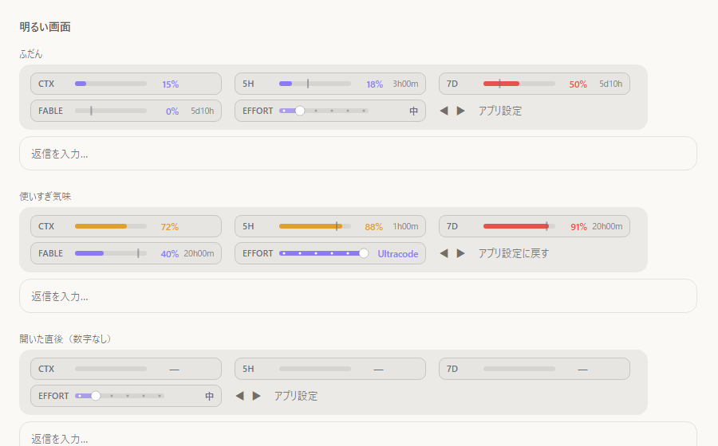

# usage-band

Claude Code の入力欄の上に、使用量メーターを出す Mod（Function Hooks のプラグイン）です。



> 上の画像は `tools/preview-band.mjs` で同じ描画コードを HTML に書き出した試し描きです。実際のアプリでは帯の灰色の背景がアプリ側の色になります。

## 出るもの

| 枠 | 中身 |
|---|---|
| CTX | 今の会話がコンテキストの何%を使っているか |
| 5H | 5時間枠の使用率と、リセットまでの残り（`3h00m`） |
| 7D | 7日枠の使用率と、リセットまでの残り（`5d10h`） |
| FABLE など | モデル別の週枠（契約に枠がある時だけ並ぶ） |
| EFFORT | 次の送信の effort。◀ ▶（デスクトップ）か、つまみを掴んで（ターミナル）変える |

- 棒の色は「時間の経過に対して使いすぎていないか」で変わります。順調＝紫、ペース速め＝琥珀、危ない＝赤
- 棒の上の細い縦線は、その枠の時間がどこまで進んだか
- EFFORT を帯で変えると、その会話の本体の送信にだけ当たります（サブエージェントは触りません）。「アプリ設定に戻す」で解除。一番右の Ultracode だけはアプリの ultracode 設定を切り替えます

## 必要なもの

- **Claude Code 2.1.287 以上**（Mod＝Function Hooks が正式に入った版）
  - ターミナル: `claude --version` で確認
  - デスクトップアプリ（Code タブ）: アプリが同梱している CLI の版で決まります。Windows なら `%APPDATA%\Claude\claude-code\` のフォルダ名が版です
  - それより古い版では、`~/.claude/settings.json` の `env` に `"CLAUDE_CODE_ENABLE_FUNCTION_HOOKS": "1"` が要りました
- モデル別の週枠（FABLE など）を出すには、PATH の通った `claude` コマンドがログイン済みであること。数分おきに `claude -p` を1本起動して `/usage` と同じ中身を聞きます（モデルは呼ばないので課金なし）。ログインしていなければ、その枠が出ないだけで他は動きます

## 入れ方

### GitHub から（ターミナルで）

```text
/plugin install usage-band --marketplace kimura-0314/claude-mod-usage-band
```

`Add marketplace?` に `y`、スコープは user を選びます。デスクトップアプリの Code タブではこのコマンドは使えませんが、ターミナルで user スコープに入れれば、デスクトップのセッションでも帯が出ます。

### 手元のフォルダから

このリポジトリを clone して、ターミナルで次の2つを打ちます。

```bash
claude plugin marketplace add /path/to/claude-mod-usage-band
```

```bash
claude plugin install usage-band@usage-band
```

`~/.claude/settings.json` に直接書く場合は次の形です（パスは自分の環境に合わせる）。

```json
{
  "extraKnownMarketplaces": {
    "usage-band": { "source": { "source": "directory", "path": "/path/to/claude-mod-usage-band" } }
  },
  "enabledPlugins": { "usage-band@usage-band": true }
}
```

入れた後は新しいセッションを開くと帯が出ます（開いているセッションは開始時の版のまま）。

## 注意

- `$.ui.status`（入力欄の下の1行）はデスクトップアプリに出ないため、入力欄の上の帯（`AbovePrompt`）に描いています
- デスクトップアプリはマウスで掴む部品（`Client`）を読み込まないので、EFFORT はデスクトップでは ◀ ▶ のボタン、ターミナルではつまみです
- 横のペインを開いて幅が足りない時は、枠ごと次の行に回ります
- 開いた直後は 5H・7D の数字がまだ届かないので、前のセッションで最後に見た値を出します（制限はアカウント単位なので同じものを指します）
- 取れなかった理由は一時フォルダの `usage-band.log` に1行だけ残ります

## 作り替える時

| ファイル | 役割 |
|---|---|
| `hooks/statusline.ts` | 数字の組み立てと絵（SVG）。純粋関数だけ |
| `hooks/register.ts` | 数字を受け取る・帯を描かせる・effort を当てる |
| `hooks/effortslider.tsx` | ターミナル用のつまみ |
| `tools/preview-band.mjs` | アプリを開き直さずに見た目を確かめる（`preview/band.html` を書き出す） |

```bash
claude plugin validate .
```

```bash
claude plugin test .
```

```bash
node --test --experimental-strip-types test/logic.node.ts
```

```bash
node --experimental-strip-types tools/preview-band.mjs
```

## 参考

- 帯＋Svg の描き方は HolyGrail/claude-mods の usage-meter
- 色の決め方は @kirillvserditov さんの進捗バー Mod、残り時間の書き方は @thegenioo さんの帯
